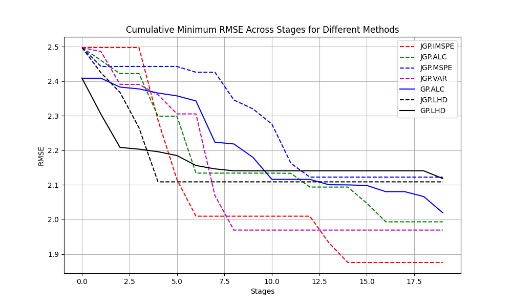

# Active Learning of Piecewise Gaussian Process Surrogates

This project implements the algorithms and models proposed in the paper:

> **Park et al. (2023)**  
> *Active Learning of Piecewise Gaussian Process Surrogates*  
> [arXiv:2301.08789](https://arxiv.org/abs/2301.08789)

## Installation

```bash
git clone https://github.com/crushonyfg/ActiveJGP.git
cd ActiveJGP
git clone https://github.com/crushonyfg/JumpGaussianProcess.git
pip install -r requirements.txt
```

# ActiveLearner: A Simple Interface for Active Learning with Gaussian Processes

This class provides a simple interface for active learning using various Gaussian Process-based methods, implementing the algorithms from the paper "Active Learning of Piecewise Gaussian Process Surrogates" (Park et al., 2023).

## Installation and Import

### Option 1: If using in the same directory
```python
from ActiveLearner import ActiveLearner
```

### Option 2: If using from another directory
First, you need to add the ActiveJGP directory to your Python path. There are several ways to do this:

1. **Add path in your code** (Recommended):
```python
import sys
import os
sys.path.append("path/to/ActiveJGP")  # Replace with actual path to ActiveJGP folder
from ActiveLearner import ActiveLearner
```

2. **Using relative path**:
```python
import sys
import os
current_dir = os.path.dirname(os.path.abspath(__file__))
parent_dir = os.path.dirname(current_dir)
sys.path.append(os.path.join(parent_dir, 'ActiveJGP'))
from ActiveLearner import ActiveLearner
```

3. **Set PYTHONPATH environment variable**:
```bash
# Windows
set PYTHONPATH=%PYTHONPATH%;path/to/ActiveJGP

# Linux/Mac
export PYTHONPATH=$PYTHONPATH:path/to/ActiveJGP
```

## Quick Start

```python
from ActiveLearner import ActiveLearner
import numpy as np

# Initialize your data
x_train = ...  # Initial training features (N x d)
y_train = ...  # Initial training labels (N x 1)
x_candidates = ...  # Candidate points (Nc x d)
y_candidates = ...  # Candidate labels (Nc x 1)
x_test = ...  # Test points (Nt x d)
y_test = ...  # Test labels (Nt x 1)

# Create and run the active learner
learner = ActiveLearner(
    x=x_train,
    y=y_train,
    xc=x_candidates,
    yc=y_candidates,
    xt=x_test,
    yt=y_test,
    method_name='MIN_IMSPE',  # Choose your method
    S=20  # Number of iterations
)

results = learner.run()
```

## Available Methods

The class supports seven different active learning methods:
- `'MIN_IMSPE'`: Minimize Integrated Mean Square Prediction Error for JGP
- `'MIN_ALC'`: Minimize Active Learning Cohn for JGP
- `'MAX_MSPE'`: Maximize Mean Square Prediction Error for JGP
- `'MAX_VAR'`: Maximize Variance for JGP
- `'GP_ALC'`: Standard Gaussian Process with ALC
- `'JGP_LHD'`: Jump GP with Latin Hypercube Design
- `'GP_LHD'`: Standard Gaussian Process with Latin Hypercube Design

## Parameters

### Initialization Parameters
- `x`: Initial training data features (N x d)
- `y`: Initial training data labels (N x 1)
- `xc`: Candidate points features (Nc x d)
- `yc`: Candidate points labels (Nc x 1)
- `xt`: Test points features (Nt x d)
- `yt`: Test points labels (Nt x 1)
- `method_name`: Active learning method name (one of the above methods)
- `S`: Number of active learning iterations
- `use_subsample`: Whether to use subsampling of candidate points (default: True)
- `ratio`: Subsampling ratio if use_subsample is True (default: 0.2)
- `logtheta`: Gaussian process hyperparameters (optional)
- `cv`: Covariance function parameters (optional), default = [covSum, [covSEard, covNoise]]

### Return Values
The `run()` method returns a dictionary containing:
```python
{
    'x_AL': Selected training points,
    'y_AL': Labels of selected points,
    'mse': Mean Square Error history,
    'rmse': Root Mean Square Error history,
    'nlpd': Negative Log Predictive Density history,
    'predictions': Prediction history,
    'prediction_variances': Prediction variance history
}
```

## Example Usage

```python
import numpy as np
from ActiveLearner import ActiveLearner
from simulate_case_d_linear import simulate_case_d_linear

# Generate synthetic data
d = 2  # dimension
N = 40  # initial points
Nt = 100  # test points
Nc = 100  # candidate points
S = 20  # iterations

# Simulate data
x, y, xc, yc, xt, yt, _, logtheta, cv = simulate_case_d_linear(d, 2, N, Nt, Nc)

# Create learner
learner = ActiveLearner(
    x=x,
    y=y,
    xc=xc,
    yc=yc,
    xt=xt,
    yt=yt,
    method_name='MIN_IMSPE',
    S=S,
    use_subsample=True,
    ratio=0.2,
    logtheta=logtheta,
    cv=cv
)

# Run active learning
results = learner.run()

# Plot results
import matplotlib.pyplot as plt
plt.plot(results['rmse'])
plt.xlabel('Iteration')
plt.ylabel('RMSE')
plt.title('Learning Progress')
plt.show()
```

## Progress Tracking
The class uses `tqdm` to show a progress bar during the active learning process, making it easy to monitor long-running experiments.

## Notes
- The implementation automatically handles data reshaping and formatting
- Early stopping occurs if no valid points are found
- Progress is displayed every 5 iterations by default
- Results are automatically saved and can be used for further analysis

## Dependencies
- numpy
- scipy
- tqdm (for progress tracking)
- matplotlib (for visualization)

## Results



This figure shows a sample RMSE result of active learning using different methods. You can reproduce it using:

```bash
python run_main_simulation.py
```

The script uses synthetic data for benchmarking.

## Usage

```python
from ActiveJGP import ActiveJGP

xt_next, criteria, bias2_changes, var_changes, pred, pred_xt, pred_var, pred_bias = ActiveJGP(
    x, y, xc, mode, logtheta
)
```

### Arguments

- `x`: numpy array of shape `(N, D)` — Training inputs  
- `y`: numpy array of shape `(N, 1)` — Training outputs  
- `xc`: numpy array of shape `(M, D)` — Candidate test inputs  
- `mode`: str — Acquisition mode, one of `['MIN_IMSPE', 'MAX_MSPE', 'MAX_VAR', 'MIN_ALC']`  
- `logtheta`: (optional) Hyperparameter for GP kernel (default: `None`)

## Contributing

Contributions of any kind are welcome! Please open an issue or submit a pull request.

## License

This project is licensed under the MIT License. See the [LICENSE](LICENSE) file for more details.

## Citation

If you use this code, please cite the following paper:

```bibtex
@article{park2023active,
  title={Active learning of piecewise Gaussian process surrogates},
  author={Park, Chiwoo and Waelder, Robert and Kang, Bonggwon and Maruyama, Benji and Hong, Soondo and Gramacy, Robert},
  journal={arXiv preprint arXiv:2301.08789},
  year={2023}
}
```
